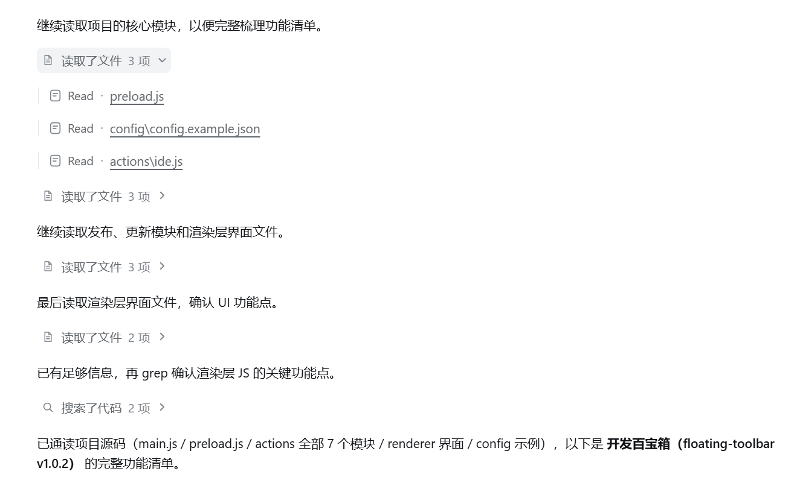

# dsh-codex-tool-view

`dsh-codex-tool-view` 是一个面向 DeepSeek Harness（DSH）原生聊天界面的显示增强插件。

它会把一次对话中分散显示的思考过程、文件读取、代码搜索、命令执行、文件编辑等活动，整理成类似 Codex 的分阶段折叠区块。这样即使 Agent 连续调用了很多工具，对话也不会被大量执行记录占满，你可以优先阅读助手的说明和最终答复，需要时再展开查看原始细节。

简单来说：

- **安装前**：思考、读文件、搜索和命令等记录逐条铺在对话中，长任务很难快速浏览。
- **安装后**：连续活动会显示为“读取了文件 3 项”“搜索了代码 2 项”“运行了命令”等紧凑区块。
- **内容不丢失**：点击区块标题即可展开原始工具记录；插件只调整显示方式，不改变 Agent 的实际执行过程。

## 效果示例

下图展示了文件读取和代码搜索记录被整理、折叠后的效果：



## 它解决什么问题

在较长的编码任务中，Agent 通常会连续执行以下操作：

1. 思考下一步操作；
2. 读取多个项目文件；
3. 搜索代码或访问网页；
4. 运行命令、修改文件并检查结果；
5. 在这些操作之间补充说明，最后给出答复。

DSH 原生聊天视图会保留这些完整记录，但工具调用较多时，重要说明和最终答复容易被执行轨迹淹没。本插件会识别每轮对话中的活动类型，把连续的同类活动合并成独立区块，同时保留原生内容和组件。

例如，连续读取 3 个文件时，主对话流中只显示一个“读取了文件 3 项”的标题。展开该标题后，仍能看到每个文件对应的原生 Read 记录和文件链接。

## 核心功能

### 按活动类型自动分组

插件会根据 DSH 提供的语义属性识别工具调用，并将连续的同类活动合并。不同类型的活动分别显示，不会把整轮操作粗略地塞进同一个大区块。用户消息、引导消息、助手说明正文和轮次结束都会形成明确边界，因此不同轮次或说明文字两侧的操作不会被错误地合并。

| 界面摘要 | 包含的活动 |
| --- | --- |
| 编辑了文件 | 写入、新建、替换或应用补丁 |
| 运行了命令 | Bash、Shell、PowerShell 及其他命令执行 |
| 读取了文件 | Read 等文件读取操作 |
| 搜索了代码 | Grep、Glob、Find 等代码或文件搜索 |
| 访问了网页 | Web 搜索、网页读取或打开链接 |
| 调用了子任务 | 创建、通知或等待子任务 |
| 更新了计划 | 创建或更新任务计划 |
| 执行了系统操作 | 上下文压缩、模型重试等系统活动 |
| 使用了工具 | 无法归入以上类别的其他工具 |

如果一个区块包含多项操作，标题旁会显示数量，例如“编辑了文件 2 项”或“运行了命令 3 条”。

### 将思考与后续操作放在一起

工具调用前的 Think 内容会归入紧随其后的工具阶段，避免对话中重复出现大量独立的“思考过程”标题。如果后面没有工具调用，这类简短轨迹会保持静默。注入的上下文也属于内部实现信息，不会单独生成可见区块。

如果助手消息同时包含 Think 内容和有意义的 Markdown 正文，插件只隐藏其中嵌套的 Think 子视图，正文、结构化计划、代码块、列表、长篇说明和最终答复仍留在主阅读流中。

### 根据执行状态自动展开

- 已完成的普通区块默认折叠，可点击标题独立展开或再次折叠。
- 正在执行的区块自动展开，并显示“正在读取文件”“正在运行命令”等状态。
- 包含错误的区块自动展开，标题显示“执行过程中出现错误”。
- 正在执行或包含错误的区块不会被手动折叠，确保当前进度和错误信息始终可见。

### 保留 DSH 原生交互

插件不会复制或替换原始工具内容。展开区块后，仍然使用 DSH 官方提供的 Read、Grep、Bash、文件链接、终端和 Inspect 等组件。

展开或折叠时，插件会尽量保持被点击标题在当前视口中的位置，减少靠近输入区操作时页面突然跳动的问题。

### 记住手动展开状态

每个区块的手动展开状态会独立保存在浏览器的 `localStorage` 中，存储键为 `dsh-codex-tool-view.expanded`。最多保留最近 200 条状态记录；这些数据不会发送到外部服务。

## 本插件不会做什么

本插件是浏览器端的界面装饰层，不是新的模型、工具或执行器。它不会：

- 修改模型提示词或影响模型如何思考；
- 发起工具调用、运行命令或修改项目文件；
- 修改会话日志、工具参数、工具结果或宿主数据；
- 向 DSH 注册额外的 tools 或 skills；
- 把对话内容上传到外部服务。

卸载或停用插件后，DSH 原始聊天内容仍然存在，只是不再以 Codex 风格进行分组。

## 适用场景

这个插件尤其适合以下情况：

- Agent 经常需要读取、搜索或编辑大量文件；
- 一轮任务包含多次命令执行和结果检查；
- 希望保留完整工具记录，但平时只看摘要；
- 希望更快定位助手说明、阶段进度、错误信息和最终答复；
- 喜欢 Codex 将执行轨迹分阶段折叠的对话节奏。

如果对话通常很短、几乎不调用工具，安装后的视觉变化会比较有限。

## 工作方式

插件挂载后会监听 DSH 聊天区域的 DOM 变化，并执行以下处理：

1. 使用用户消息、引导消息和轮次尾部识别对话边界；
2. 根据 `data-chat-flow-kind`、`data-tool` 和 `data-state` 等语义属性判断活动类型和状态；
3. 在原始活动行之前插入紧凑的分组标题；
4. 通过插件自己的 `data-codex-*` 属性控制原始行的显示和隐藏；
5. 聊天内容发生变化时重新整理分组，插件停用时移除生成的标题、属性和样式。

插件不会克隆、移动或删除由 React 管理的聊天内容。

## 兼容性

- 插件版本：`0.5.0`
- DSH：`>=0.1.0-rc.6 <0.2.0`（已在 `0.1.5-rc.2` 上核对契约与语义锚点）
- Node.js：`^22.19.0 || >=24.0.0`
- 客户端平台：Web

### 客户端加载契约

本插件是浏览器端插件包，遵循 DSH 当前的客户端装载模型：

- `package.json` 的 `dsh.client` 声明 `platform: "web"`，并以 `exports["./client"]` 指向 bundle；
- `lib/client.js` 以 `window.__ModuleLoader__.load({ id, factory })` 登记工厂，`id` 与包名一致；
- 工厂形如 `factory(require)`，返回 `module.exports`，其中导出 `apply(ctx)`（挂载）与 `inject`（所需服务）；
- 插件只使用模块表基线与原生 DOM，不 `require` 任何其他插件包，因此无需声明 `dsh.client.external`。

改动这一层契约会让插件在客户端静默不激活：DSH 只会登记工厂，`apply` 不会运行，页面保持原生外观。

### 依赖的语义锚点

插件只依赖 DSH 输出的语义属性，不依赖生成的 CSS Module 类名：

- `data-chat-flow-kind`、`data-chat-flow-key`：对话行类型与稳定键
- `data-tool`、`data-state`：工具行名称（`read`/`grep`/`bash`/`write`/`edit`/`web_fetch`/`web_search`/`pwsh`/`run_code` 等）与状态（`ok`/`running`/`error`/`stopped`）
- `data-variant="think"`：思考子视图
- `data-turn-process`、`aria-expanded`：原生 Turn 过程折叠控件
- `hidden="until-found"`：原生折叠时对其成员行的隐藏方式

如果未来的 DSH 版本更改了 DOM，导致这些锚点不可用，插件不会修改对应内容，原始聊天视图仍保持可见。

### 与原生 Turn 过程折叠共存

较新的 DSH 会把一轮内的过程收进原生「过程」折叠控件，并用 `hidden="until-found"` 隐藏成员行。插件让出这一层折叠：

- 某一轮被原生控件折叠时，插件不生成分组标题，避免出现空标题；
- 原生控件展开时，插件在过程内部按活动类型继续细分；
- 用户展开某一组后又把它折叠，若该轮已无可见内容，插件会折叠原生控件本身，把折叠状态交还给原生 UI。

## 本地安装

1. 把本项目目录作为 `link:` 依赖加入目标 profile 的 `package.json`：
   ```jsonc
   {
     "dependencies": { "dsh-codex-tool-view": "link:/path/to/dsh-codex-tool-view" },
     "dsh": { "profile": { "bundles": ["...", "dsh-codex-tool-view"] } }
   }
   ```
   `dsh.profile.bundles` 里只能写包名，`link:` 前缀只出现在 `dependencies`。
2. 在该 profile 目录执行 `pnpm install`；
3. 重启宿主（`dsh --profile <name> web` 等）。客户端 bundle 只在宿主启动时合成进 boot 图，未重启不会生效；
4. 打开一个包含工具调用的对话，确认连续活动显示为可折叠区块。

也可以用 `dsh plugin --profile <name> add <路径>`（该命令是 pnpm 的转发器）：安装后仍要确认包名已出现在 `dsh.profile.bundles` 中，缺失时 DSH 会大声报错，而不是静默忽略。

## 开发与自测

仓库自带一个最小 DOM 仿真，不需要浏览器即可运行行为断言：

```bash
node scripts/test-client.mjs
```

它按 DSH 的方式装载 `lib/client.js`（`__ModuleLoader__` 工厂 + `ctx.effect` 挂载），并用合成对话断言分组、状态展开、原生折叠共存与卸载清理等 10 项行为。改动 `lib/client.js` 后应先跑通它，再重启宿主做端到端确认。

## 项目结构

| 路径 | 说明 |
| --- | --- |
| `lib/client.js` | 浏览器端分组、折叠、状态监听与样式逻辑 |
| `lib/index.js` | DSH 插件主入口（宿主侧无操作，仅用于被发现） |
| `cordis.patch.yml` | 注册宿主条目，使 DSH 发现并提供客户端 bundle |
| `dsh.plugin.json` | 插件 ID、版本、入口和 DSH 版本要求 |
| `scripts/test-client.mjs` | 行为断言入口 |
| `scripts/test-client-harness.mjs` | 最小 DOM 仿真与装载器 |
| `docs/images/` | README 使用的示例图片 |

## 许可证

MIT
